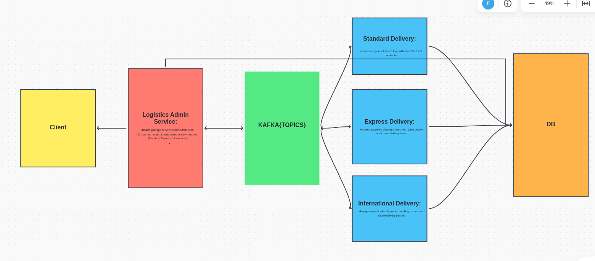

# DSA_ASS2_2024
Containerized Microservices with Ballerina and Kafka for Course Title: Distributed Systems and Applications   Course Code: DSA612S   Assessment: Second Assignment 

## How to create the db for local dev, and other info
### Do NoT edit the kafka folder properties !!

